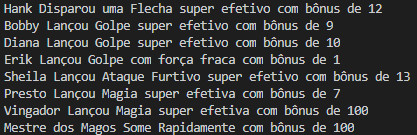

# Desafio de Projeto: Abstraindo um Jogo de RPG Usando Orientação a Objetos com C#

Desafio de Projeto do **Bootcamp Bootcamp Geração Tech Unimed-BH - Fullstack**, promovido pela [Digital Innovation One](https://www.dio.me).

## Descrição do Desafio

Reforce seu conhecimento em Programação Orientada a Objetos (POO) em C# com um desafio de projeto totalmente prático. Para isso, os pilares da orientação a objetos serão devidamente explorados no contexto de um jogo de RPG. Com isso, você poderá desenvolver sua capacidade de abstração com um problema real e implementar as evoluções que julgar necessárias ;)

**Desafio:** Abstraindo um Jogo de RPG Usando Orientação a Objetos com C#

**Ajustes Feitos:**

- Inclusão das categorias de Acrobat, Archer, Barbarian, Knight, Rogue e Wizard;
- Inclusão dos personagens da Caverna do Dragão;
- Adaptação para o que realmente ocorre no desenho, ou seja, o Mestre dos Magos some no final!


**Tela de Execução:**




**Como Executar o programa?**

Clone ou baixe o repositório.

Entre no diretório dotnet-poo e execute com o comando abaixo:

```
dotnet run
```