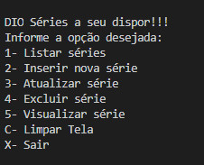

# Desafio de Projeto: Criando um APP simples de cadastro de séries em .NET

Desafio de Projeto do **Bootcamp Bootcamp Geração Tech Unimed-BH - Fullstack**, promovido pela [Digital Innovation One](https://www.dio.me).

## Descrição do Desafio

Aprenda como criar um algoritmo simples de cadastro de séries para praticar seus conhecimentos de orientação a objetos, o principal paradigma de programação utilizada no mercado. Nesse projeto você vai aprender: Como pensar orientado a objetos, como modelar o seu domínio, como utilizar recursos de coleção para salvar seus dados em memória.

**Desafio:** Criando um APP simples de cadastro de séries em .NET


**Tela de Execução:**




**Como Executar o programa?**

Clone ou baixe o repositório.

Entre no diretório dio-dotnet-poo-lab2 e execute com o comando abaixo:

```
dotnet run
```