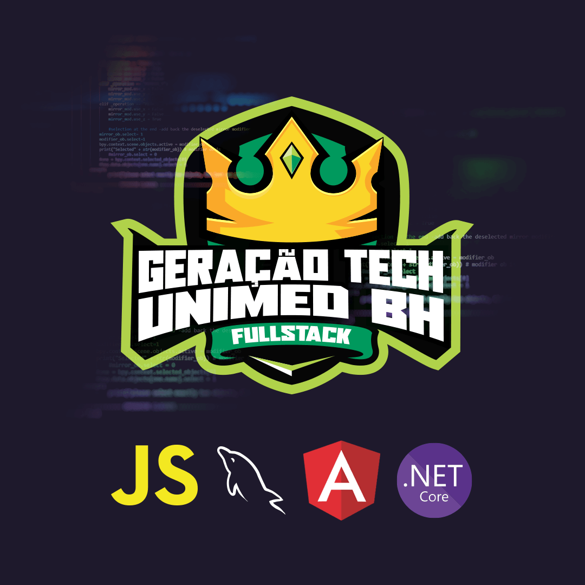
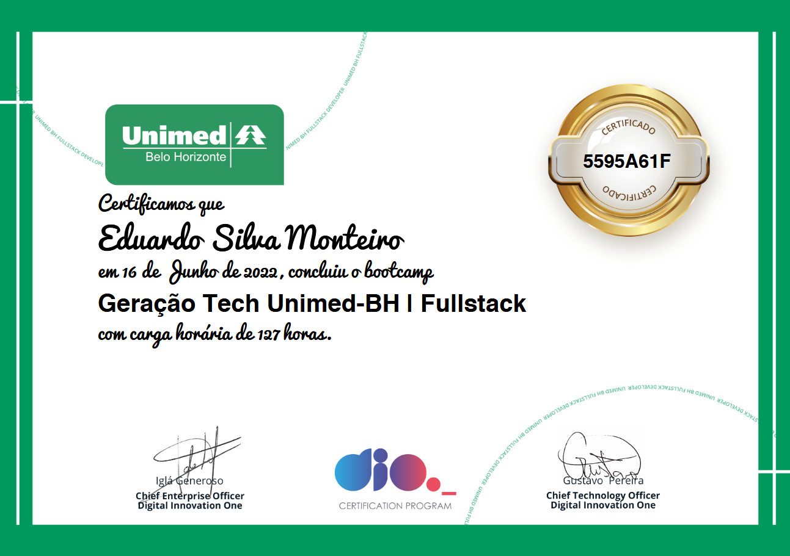

# Geração Tech Unimed-BH - Fullstack
Conteúdos e códigos do Bootcamp Geração Tech Unimed-BH - Fullstack.

**Sobre o Bootcamp**
O Programa Geração Tech Unimed-BH é um programa que oferece bootcamps gratuitos. Nesta primeira edição, o bootcamp ofertado formará novos desenvolvedores fullstack nas tecnologias Javascript, MySQL, Angular e .NET.
Durante o bootcamp, você irá desenvolver projetos práticos, participar de mentorias ao vivo e exclusivas, obter seu certificado e ainda complementar seu portfólio. Ao final do programa, a Unimed-BH espera contratar os melhores perfis para atuar na região de Belo Horizonte.

**Conclusão do Bootcamp:** 16/06/2022

